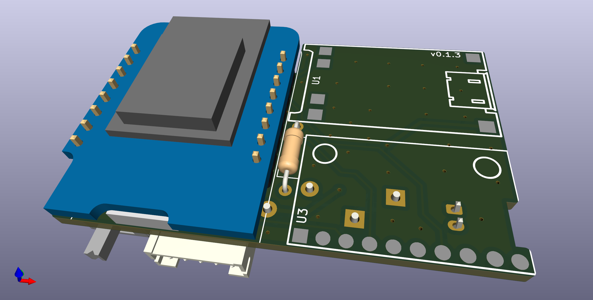
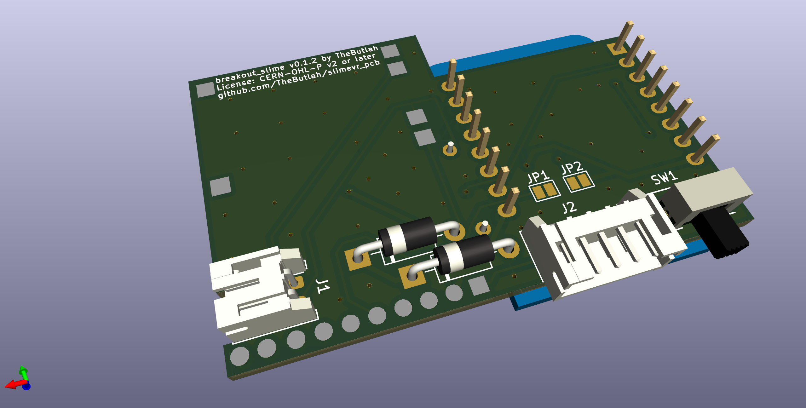
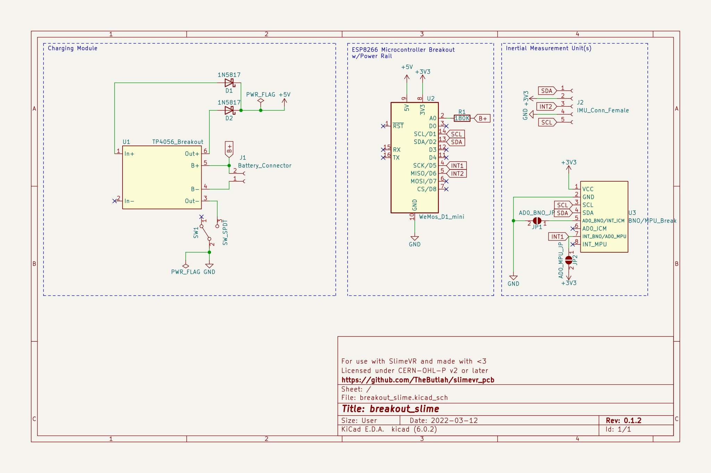
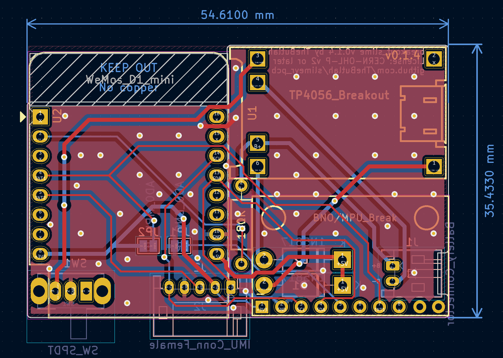

# Breakout SlimeVR
This PCB design is intended as the easiest DIY SlimeVR pcb. It is a simple two
layer PCB, and should make assembling SlimeVR significantly easier than using a
protoboard.

**NOTE: This has only been tested on BNOs and MPUs.**
Also, use it at your own risk. I've tested it, but I accept no responsibility for it ;)

## Renders

## Changelog
A description of the changes in each revision can be found [here](CHANGELOG.md).

## How to order
You can place a jlcpcb order by uploading the [zip file](jlcpcb/gerber/GERBER-breakout_slime.zip) for the gerbers. Take that zip file and upload to https://jlcpcb.com.
