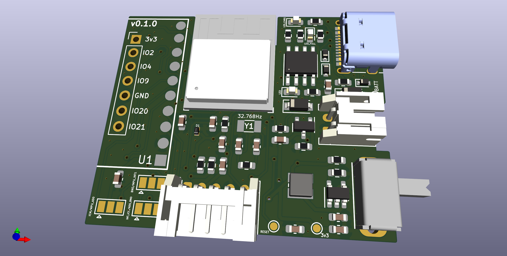
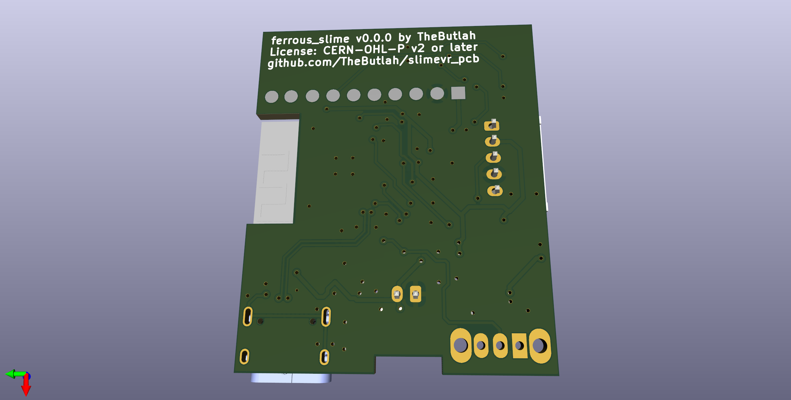
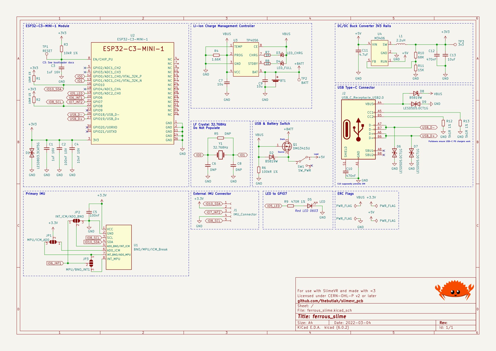
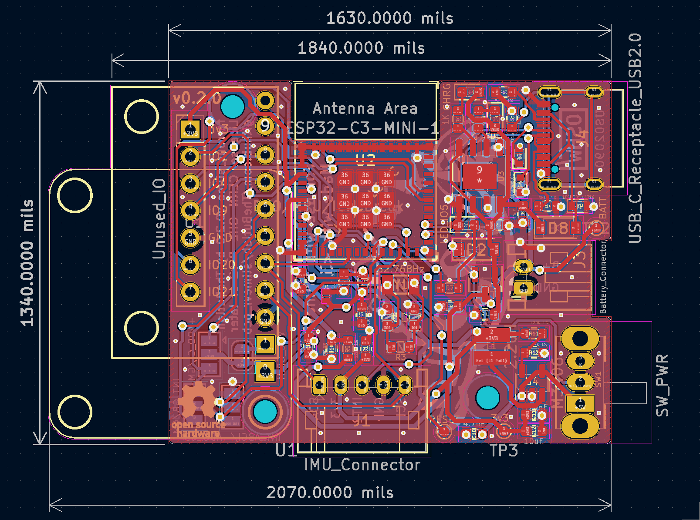

# Ferrous SlimeVR
This PCB design is intended as a production-ready (mostly) SMT design. Unlike
current SlimeVR designs by the community and the production batch that use the
ESP8266, this board uses the *very* new ESP32-C3 chip, which is better in almost
all respects than its predecessors.

The IMU is still a breakout board to better allow the community to experiment
with different IMU options.

## Renders

## IMU Compatibility
This board was designed to work with the following IMU breakouts. Not all have
been tested, but there are solder jumpers that can reconfigure the board.
- BNO08X
- MPU-6050
- MPU-9250/6500
- ICM20948 (Assuming breakout is 3.3v *not* 1.8v)

As always, check to make sure your particular breakout board has the pins in the
right spots for this PCB! Not all breakouts of the same IMU have the same pins!

## Why the ESP32-C3?
First and foremost, the ESP32-C3 uses RISC-V as its instruction set, rather than
XTensa. XTensa is not supported by LLVM (yet), or by the Rust programming language,
without using a [fork of the compiler](https://github.com/espressif/llvm-project).
I wanted to use this design in future IOT projects as well, so targeting a more
mainstream instruction set with better compiler support seems useful. It will also
help me more easily use Rust with this device!

Secondly, the ESP32-C3 is similar in features to the ESP32 series of chips, but like
the ESP8266, it is very cheap, making it a great choice. A few of the features it has
over the ESP8266:
- Bluetooth LE v5.0 (even ESP32 only has v4.2)
- Stronger WiFi signal at a lower power usage than the ESP8266
- More RAM (400KiB vs 160)
- Built-in USB-serial and USB-JTAG support eliminates need for USB-UART chip
- JTAG debugging
- Sleep modes consume *significantly* less power
- New peripherals like security modules
- GPIO is more fully featured, and has more pins

For more info, [this](https://hackaday.com/2021/02/08/hands-on-the-risc-v-esp32-c3-will-be-your-new-esp8266/)
was a good article.

## Changelog
A description of the changes in each revision can be found [here](CHANGELOG.md).
