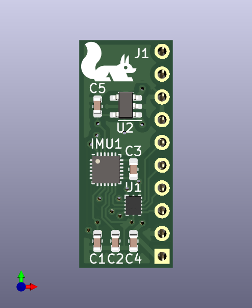
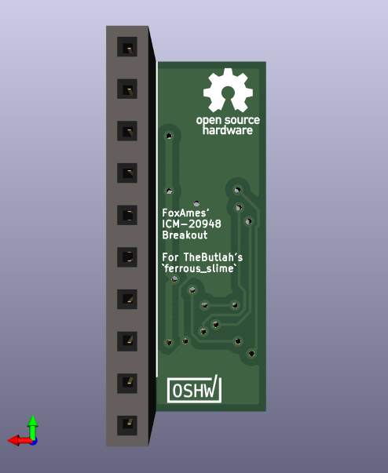
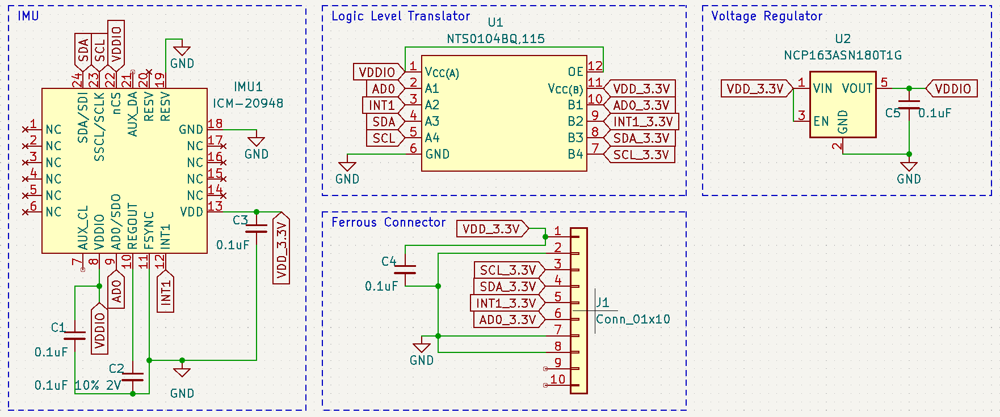

# ICM-20948 Breakout for `ferrous_slime`
This is a breakout board for the [ICM-20948](https://invensense.tdk.com/products/motion-tracking/9-axis/icm-20948/) IMU, targeting the [`ferrous_slime` board by TheButlah](https://github.com/TheButlah/slimevr_pcb/tree/main/hardware/ferrous_slime).  It contains a voltage translator to allow 1.8v<->3.3v communication between the IMU and the ESP.

The pin socket is optional and only serves to allow rapid prototyping of the board.  Final revisions may be directly soldered to the `ferrous_slime` or attached via a double-sided pin header.

*Note: This breakout is currently being tested and may not work as intended.*

## Renders

## Thanks
- [dtornqvist](https://github.com/dtornqvist/icm-20948-breakout) for a part list and implementation reference
